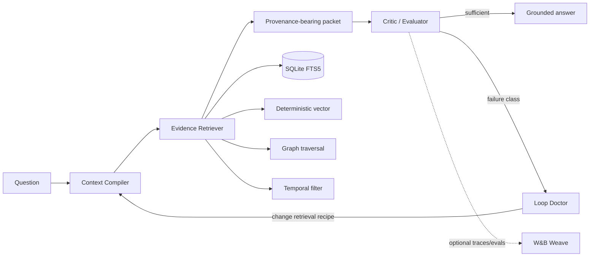

# Architecture

The critical distinction is that the Loop Doctor changes retrieval behavior rather than merely rephrasing an answer. Evidence keeps source, event time, and observation time. The fixture evaluator fails closed when required support is absent.
