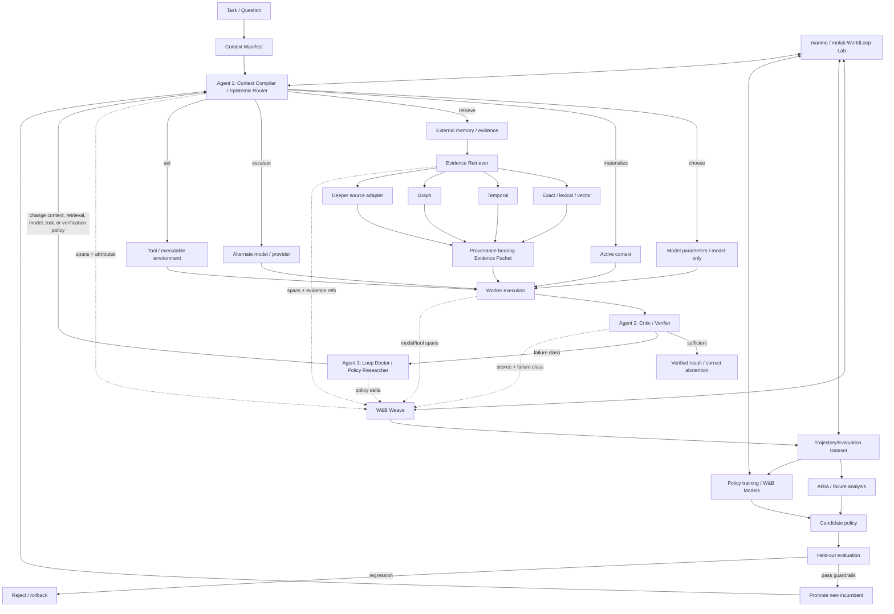
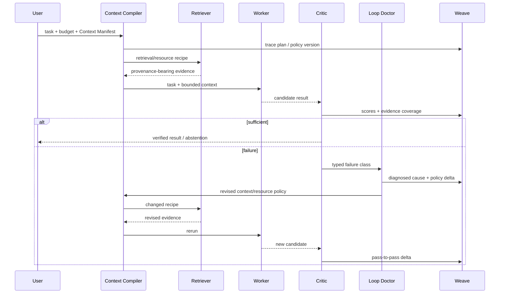
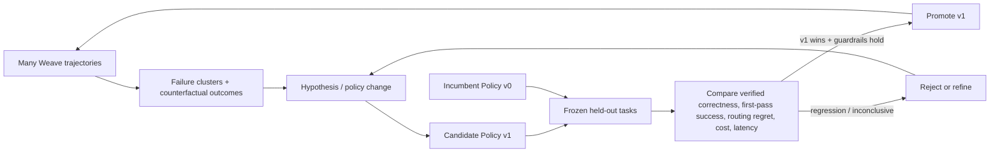
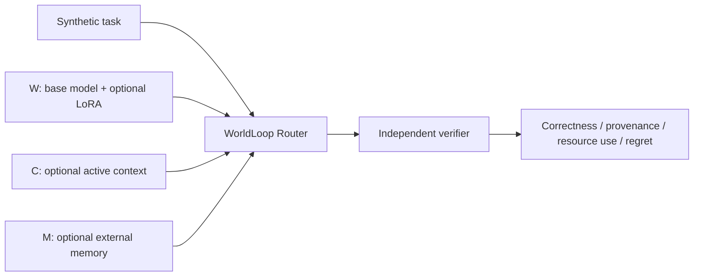
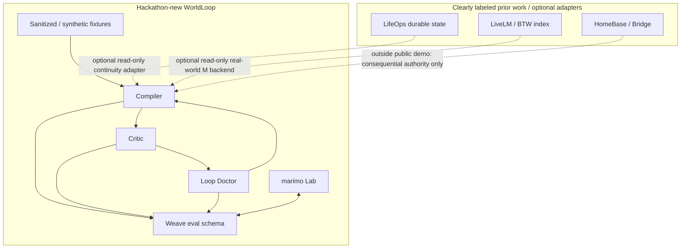

# WorldLoop Architecture

WorldLoop is a **self-improving context and epistemic/resource compiler**. The hackathon system is intentionally smaller than the larger LifeOps/Agent-OS vision: it proves that cooperating agent roles can choose cognitive resources, independently detect when that choice failed, change behavior, and use the resulting trajectories to improve future policy.

See `DESIGN.md` for the canonical behavioral specification and invariants.

## 1. End-to-end architecture



The central architectural distinction is that the **Critic is independent of the Compiler's choice**, and the **Loop Doctor changes an actual decision variable** rather than asking the same model to rewrite its prose.

## 2. Inner agent loop: self-correction



Examples of valid policy changes include adding graph/temporal retrieval, changing the context schema, escalating model/provider, adding a verifier, reducing unnecessary retrieval, or abstaining. Merely rephrasing the answer is not a repair.

## 3. Outer learning loop: improvement across tasks



The outer loop is what separates **self-correction** from **learning**. Same-task improvement proves a loop can repair itself. Held-out v0-v1 improvement proves previous failures changed future behavior.

## 4. Knowledge-location experiment

WorldLoop treats knowledge location as an experimental variable:

```text
W = behaviorally accessible parameterized knowledge
C = active request/context
M = externally retrievable memory
```

The controlled experiment creates fictional facts that cannot plausibly exist in pretraining and toggles W/C/M independently. For an open model, W can be manipulated with a LoRA adapter on/off. C is known because WorldLoop records the exact Context Manifest. M is known because every external evidence item has a stable source/provenance record.



Run all 2^3 combinations plus conflicts such as stale W versus current M. Hosted/closed models may be measured behaviorally but should not be described as causal weight inspection unless internals are actually exposed.

## 5. Data and source boundaries



The public judging baseline cannot require prior/private systems. BTW can demonstrate generalization to a real changing-world memory backend, but the index itself is not hackathon-new work.

## 6. Tool responsibilities

| Component | Owns | Does not own |
|---|---|---|
| **WorldLoop** | loop semantics, context/resource policy, typed handoffs, evaluation contracts | canonical mutable world truth or external authority |
| **W&B Weave** | trajectory/evaluation proof, attributes, scores, version comparison | agent runtime or execution sandbox |
| **marimo / molab** | interactive experiment control, analysis, W/C/M visualization, bounded training workbench | canonical durable state or long-term artifact storage |
| **W&B Models / Artifacts** | training/data/model lineage | online routing logic by itself |
| **W&B Inference** | comparable hosted model fleet / optional LoRA serving | canonical evaluation truth |
| **ARIA** | outer-loop hypothesis and experiment design | unreviewed direct production policy mutation |
| **TypeSafe AI** | candidate worker/router/verifier | critical dependency until actual interface/capabilities are measured |
| **CoreWeave Sandboxes** | isolated stateful/code-execution episodes | static retrieval by default |
| **SkyPilot** | optional compute/job placement and parallel execution | reasoning, durable state, or authority |
| **LifeOps** | optional cross-provider durable continuity (prior work) | hackathon-new claim |
| **BTW / LiveLM** | optional real-world external-memory backend (prior work) | core reproducible benchmark |
| **HomeBase / Bridge** | consequential action authority/verification (prior work) | reasoning or retrieval policy |

## 7. marimo WorldLoop Lab

The marimo notebook/app is not a decorative dashboard. It is the live scientific workstation with five target views:

1. **Live Loop** — task, Context Manifest, pass table, evidence, failure class, policy delta, final verification, Weave run ID.
2. **Policy Comparison** — v0/v1 held-out first-pass success, recovery, routing regret, resource usage, latency/cost.
3. **Knowledge Location** — interactive W/C/M cube and conflict cases.
4. **Failure Explorer** — aggregate failure classes with drill-down to traces and counterfactual routes.
5. **Experiment Registry** — hypotheses, metrics, stop rules, status, and durable artifact refs.

molab's GPU is an interactive experiment/fine-tuning resource; persistent source and artifacts remain in GitHub/W&B/approved storage.

## 8. Primary proof hierarchy

1. **Required:** deterministic failure -> diagnosis -> changed retrieval/context behavior -> verified repair.
2. **Required for strong self-improvement claim:** policy v0 -> v1 held-out first-pass improvement or lower routing/context regret at equal verified correctness.
3. **Strong extension:** real model/provider comparison and ARIA-generated experiment.
4. **Hero extension:** W/C/M causal cube plus small trained router/LoRA.
5. **Real-world validation:** hackathon-built read-only adapter to pre-existing BTW/LiveLM.

## 9. Safety and production invariants

- insufficient or unresolved conflicting evidence fails closed;
- exact code/data/evidence/model/policy/scorer versions are bound to runs;
- no train/test leakage or online access to counterfactual oracle labels;
- candidate policies are evaluated before promotion and remain rollbackable;
- source-native evidence outranks stale model memory for mutable facts;
- model confidence never grants external execution authority;
- no private prior system is required for the public demo.
