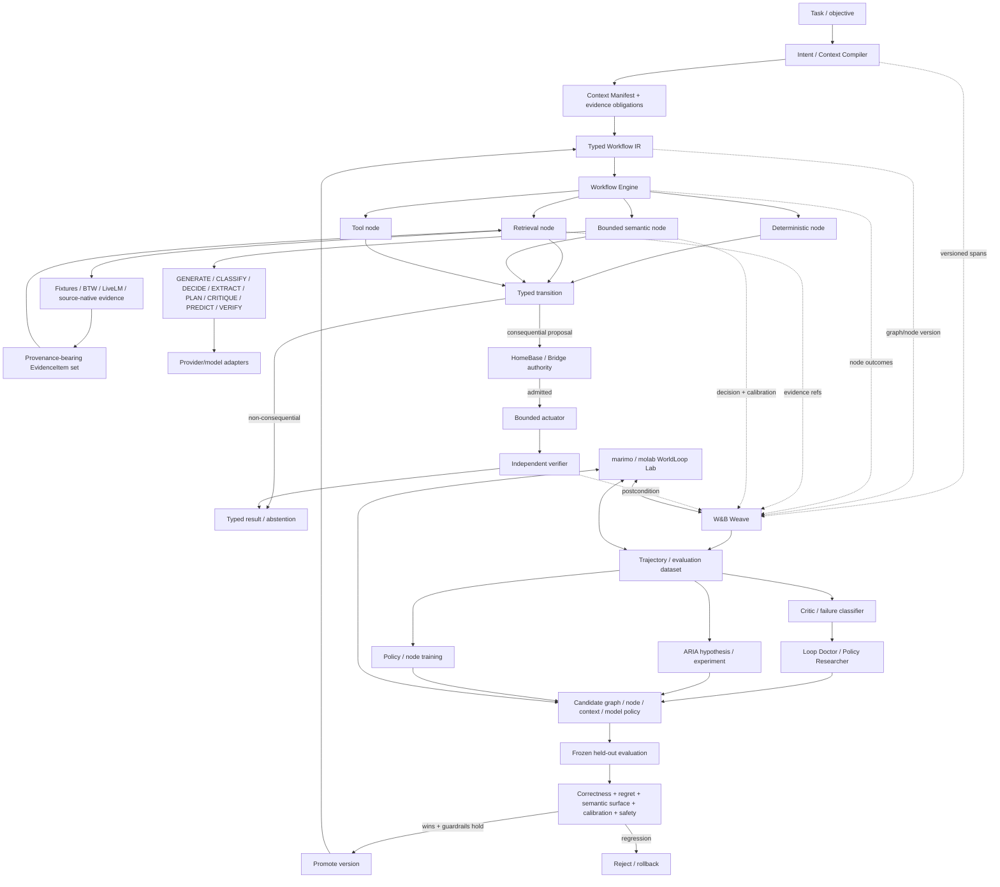
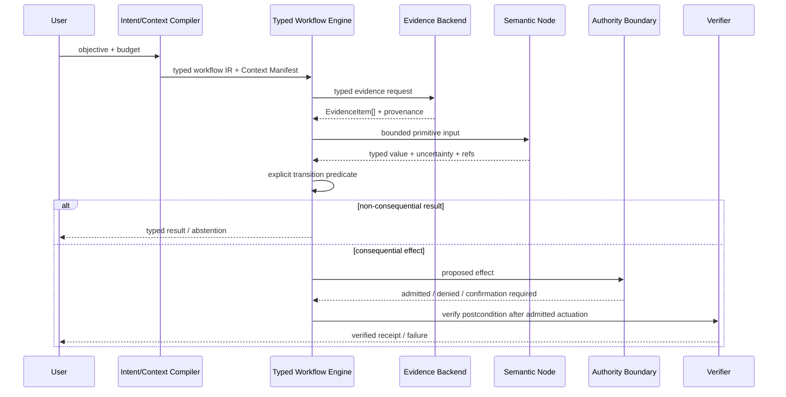
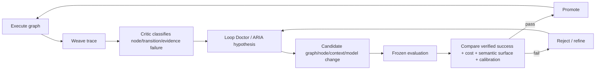
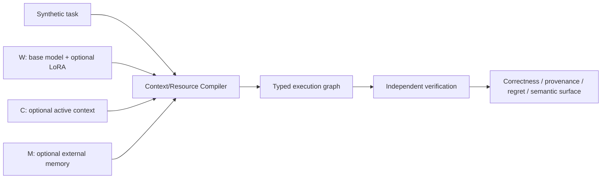
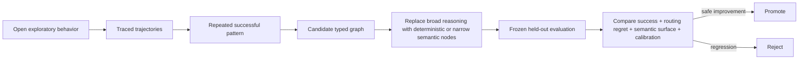
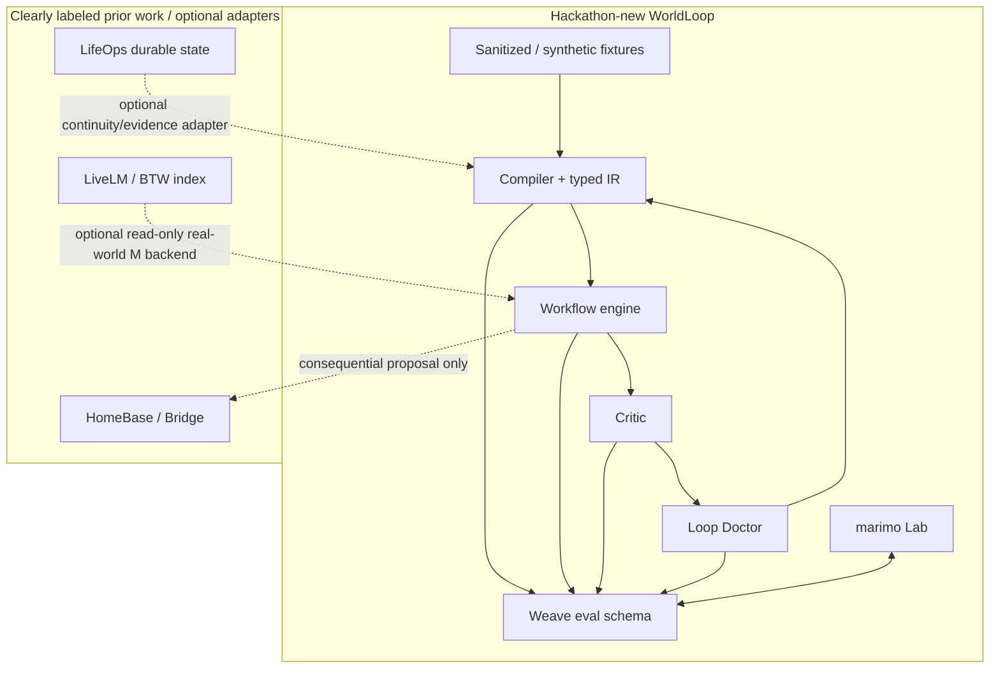

# WorldLoop Architecture

WorldLoop is a **self-improving context, resource, and execution compiler**. The hackathon loop remains the learning/debugging mechanism, but the production destination is a typed workflow/state machine: deterministic where possible, semantically intelligent only where necessary, explicit about evidence and transitions, and separated from authority and real-world verification.

See `DESIGN.md` for the broader behavioral specification and `TYPED_EXECUTION_IR.md` for the execution-IR contract.

## 1. End-to-end architecture



The central invariant is now stronger than “the Critic is independent”: **the model does not own global control flow**. Semantic intelligence is local to typed nodes; explicit transition logic decides what happens next.

## 2. Runtime path vs learning loop

### Production/runtime path



A semantic node may inform a transition, but it never emits an arbitrary next-state instruction and never grants itself execution authority.

### Learning/debugging loop



This loop is intentionally agentic and exploratory. Its job is to make the runtime graph more reliable and, where possible, less open-ended.

## 3. Intelligence primitives

Provider neutrality should exist below a typed semantic API rather than collapsing every model into `messages -> text`.

WorldLoop semantic primitives:

```text
GENERATE  context -> artifact
CLASSIFY  evidence -> enum + confidence
DECIDE    evidence + alternatives + stakes -> alternative | abstain + confidence
EXTRACT   evidence -> typed facts + provenance
PLAN      goal + world state -> typed proposed graph
CRITIQUE  artifact + invariants -> violations[]
PREDICT   state + intervention -> distribution(outcomes)
VERIFY    claim + evidence -> supported | contradicted | unknown
```

Different providers may implement different subsets. TypeSafe is evaluated as a possible provider for bounded machine-native decisions/classification/prediction if the real onsite interface supports them; no undocumented API is assumed.

## 4. Knowledge-location experiment

WorldLoop still treats knowledge location as an experimental variable:

```text
W = behaviorally accessible parameterized knowledge
C = active request/context
M = externally retrievable memory
```



The stronger question is not only “where did the fact come from?” but “how much semantic intelligence was actually necessary once the right evidence and workflow structure were available?”

## 5. Progressive compilation

WorldLoop should learn to compile repeated successful behavior into smaller typed programs.



New metrics include semantic-node count, semantic-surface ratio, compilation ratio, calibration error, and authority-bypass attempts. A lower semantic surface is only better if verified correctness and guardrails hold.

## 6. Data and source boundaries



The public judging baseline cannot require prior/private systems. BTW can demonstrate generalization to a real changing-world memory backend, while HomeBase/Bridge remains a distinct authority boundary rather than part of WorldLoop reasoning.

## 7. Tool responsibilities

| Component | Owns | Does not own |
|---|---|---|
| **WorldLoop** | compilation, typed IR, context/resource policy, evaluation contracts | mutable world truth or authority |
| **Typed Workflow Engine** | explicit states/transitions and bounded node execution | semantic truth or permission minting |
| **W&B Weave** | trajectory/evaluation proof, graph/node versions, scores, comparisons | runtime authority |
| **marimo / molab** | live experiment/control/analysis, graph and W/C/M visualization | canonical durable state |
| **W&B Models / Artifacts** | dataset/model/policy lineage | runtime control flow |
| **W&B Inference** | comparable model fleet / optional LoRA serving | evaluation truth |
| **ARIA** | outer-loop hypotheses/experiments | direct unreviewed production mutation |
| **TypeSafe AI** | candidate semantic primitive implementation | authority or assumed undocumented capabilities |
| **CoreWeave Sandboxes** | isolated stateful/code-execution nodes | default static retrieval |
| **SkyPilot** | optional parallel job/compute execution | reasoning or project state |
| **LifeOps** | optional durable continuity (prior work) | hackathon-new claim |
| **BTW / LiveLM** | real-world evidence backend (prior work) | control flow or authority |
| **HomeBase / Bridge** | consequential authorization/admission | epistemic reasoning |
| **Independent verifier** | actual-world postcondition checks | authorization |

## 8. marimo WorldLoop Lab

The Lab should now expose six views:

1. **Live Execution** — task, Context Manifest, compiled graph, current node, evidence, typed outputs, transitions, final verification.
2. **Policy / Program Comparison** — v0/v1 held-out success, recovery, routing regret, semantic-node count, semantic-surface ratio, latency/cost.
3. **Knowledge Location** — W/C/M cube and conflict cases.
4. **Failure Explorer** — node/transition/evidence failure classes with trace drill-down.
5. **Compilation View** — before/after graph showing which open-ended operations became deterministic or narrow semantic nodes.
6. **Experiment Registry** — hypotheses, metrics, stop rules, status, artifact refs.

## 9. Primary proof hierarchy

1. **Required:** a failure is traced to a specific resource/context/node decision and repaired by changing an actual decision variable.
2. **Required for strong self-improvement claim:** candidate policy/program improves held-out first-pass success or routing/context regret without correctness regression.
3. **Stronger:** show the candidate also reduces semantic surface or replaces an open-ended step with an explicit typed transition.
4. **Strong extension:** real provider/model comparison and ARIA-generated graph/node experiment.
5. **Hero extension:** W/C/M causal cube plus trained router/semantic node.
6. **Real-world validation:** read-only BTW/LiveLM evidence backend under the same typed contract.

## 10. Safety and production invariants

- the model never owns global control flow;
- every node has typed inputs/outputs and explicit transitions;
- insufficient or unresolved conflicting evidence fails closed;
- exact code/data/evidence/workflow/node/model/policy/scorer versions are bound to runs;
- counterfactual oracle labels never leak into online routing inputs;
- candidate graphs/policies are evaluated before promotion and remain rollbackable;
- source-native evidence outranks stale model memory for mutable facts;
- confidence is not authority;
- authorization, actuation, and verification are distinct stages;
- no private prior system is required for the public demo.
